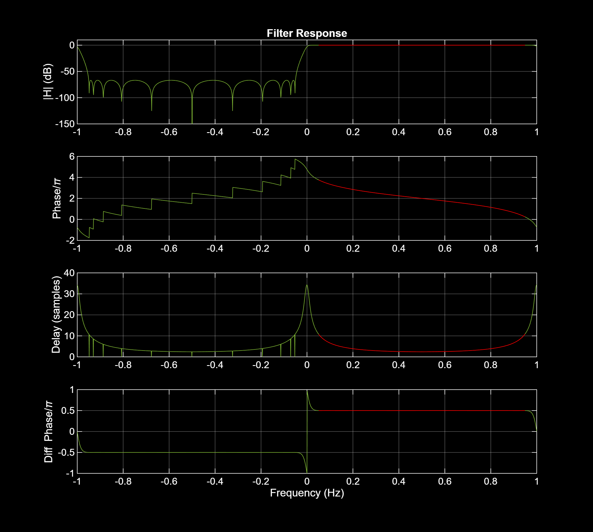
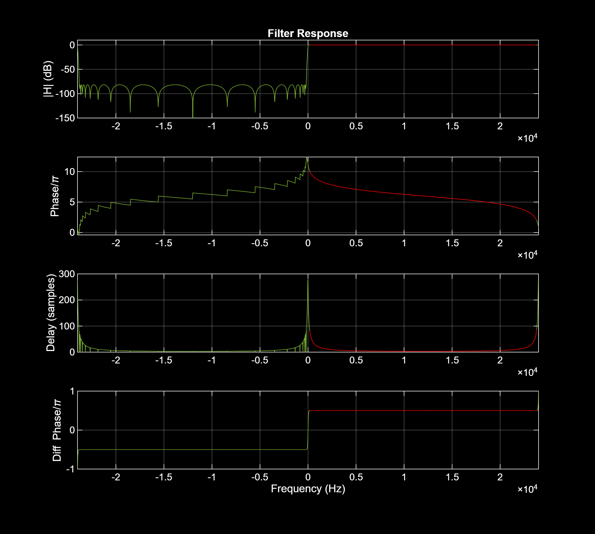
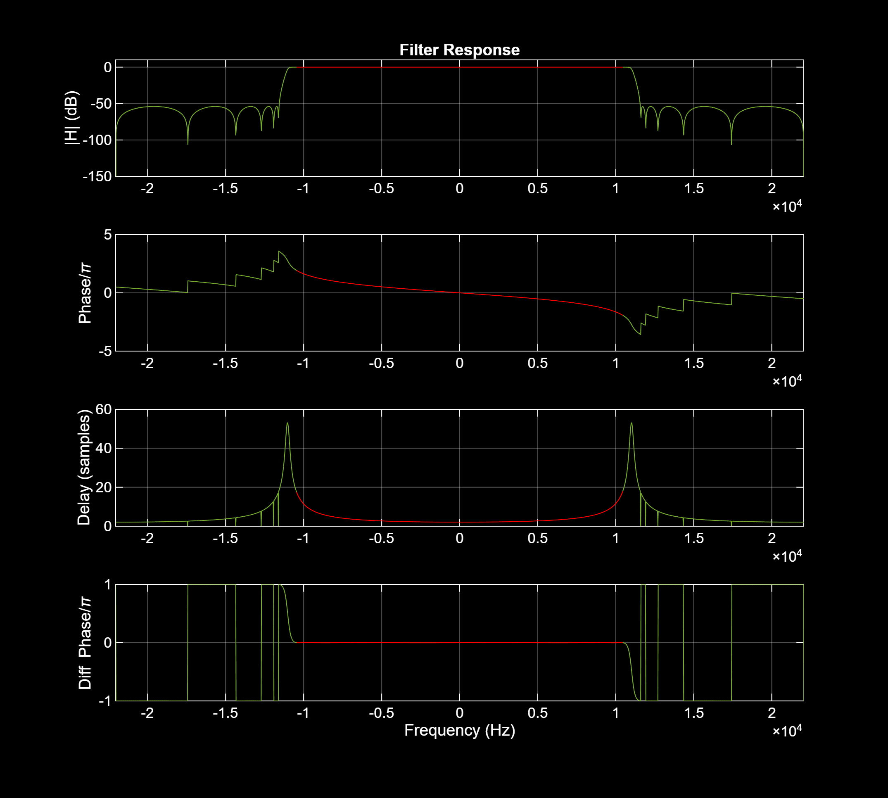

# Design Hilbert-based IIR analytic signal transformers in MATLAB and GNU Octave

This repo contains tools to design and analyze IIR Hilbert transformer filters. The code is MATLAB and GNU Octave compatible, with no dependency on MATLAB toolboxes or GNU Octave packages. The main design function implements the method described in [1]. Because the method derives a Hilbert filter from a halfband prototype, the tool can also be used to design halfband IIR filters.

# Files
* hilbert_iir.m - The main design and analysis program
  * ```hilbert_iir``` takes zero or more of the following _Name,Value_ pairs in any order
    * ```'As', As``` - Stopband attenuation in dB (default 60)
    * ```'Fs', fs``` - Sampling frequency in Hz  (default 2)
    * ```'Ftype', ftype``` - Filter type, one of 'hilbert' (default), 'lpf'
    * ```'TBWN'```, tbwn - Normalized transition bandwidth, 0<tbwn<1 (default 0.1)
      * $tbw = (f_{stop} - f_{pass})$
      * $tbwn = tbw/f_{nyquist}$
      * $f_{nyquist} = f_s/2$
      * $f_{pass}$ is the passband edge frequency of the halfband prototype filter
      * $f_{stop}$ is the stopband edge frequency of the halfband prototype filter
      * Passband edge is the frequency at which the linear gain reaches $1 - 10^{-As/20}$
      * Stopband edge is the frequency at which the linear gain reaches $10^{-As/20}$
    * 'VERBOSE', verbose - set to 0 to run quietly, set to 1 for plots and info
  * ```hilbert_iir``` returns struct _info_ containing the following members
    * ```ftype``` - Filter type, one of 'hilbert' (default), 'lpf'
    * ```stopband_atten_db```
    * ```transition_bandwidth_hz```
    * ```fpass_hz``` - Passband edge frequency of halfband prototype filter
    * ```filter_order```
    * ```filter_coefs``` - Array of magnitude-squared pole values
    * ```sos0,sos1``` - Second order section (SOS) description for upper,lower allpass branches
      * SOS uses MATLAB / GNU Octave SOS format to describe each second order stage
         $SOS = \begin{bmatrix}
          b_{01} & b_{11} & 1 & a_{11} & a_{21}\\\
          b_{02} & b_{12} & 1 & a_{12} & a_{22}\\\
          \vdots & \vdots & \vdots & \vdots & \vdots\\\
          b_{0N} & b_{1N} & 1 & a_{1N} & a_{2N}
          \end{bmatrix}$
      * The $k^{th}$ row describes the transfer function of one SOS stage  
         $H(z) = \prod\limits_{k=1}^{N} \frac{b_{0k} + b_{1k}z^{-1} + b_{2k}z^{-2}}{1 + a_{1k}z^{-1} + a_{2k}z^{-2}}$
      * sos0 describes the upper branch, the real path of the hilbert filter
      * sos1 describes the lower branch, the imaginary path of the hilbert filter
    * ```F``` - Frequency array used to evaluate filter responses (Hz)
    * ```H``` - Frequency response array (linear scale)
    * ```H0,H1``` - Frequency response array for upper,lower allpass branches (linear scale)
    * ```gain``` - Magnitue response array (dB)
    * ```phase``` - Phase response array (radians)
    * ```Gd``` - Group delay response array (samples)
    * ```diff_phase_rad``` - Branch differential phase (radians)

* halfband_poles.m - Calculate IIR filter coefficients using the method described in [1]
  * ```[P,P0,P1] = halfband_poles(wp,As)``` inputs
    * ```wp``` - normalized passband edge frequency of halfband prototype filter (radians)
      * $wp = \pi(f_{nyquist} - TBW)/f_s$
      * $0 < wp < 2\pi$
      * $f_{nyquist} > TBW > 0$
    * ```As``` - stopband attenuation (dB)
  * ```[P,P0,P1] = halfband_poles(wp,As)``` returns
    * ```P``` - 1-d array of IIR coefficients (magnitude-squared poles)
    * ```P0``` - 1-d array, partition of P corresponding to the upper allpass branch (real path of Hilbert filter)
    * ```P1``` - 1-d array, partition of P corresponding to the lower allpass branch (imaginary path of Hilbert filter)

* sosfilter.m - Filter signal through cascade of second order sections (SOS)
  * ```y = sosfilter(sos,x)``` inputs
    * ```sos``` - N-by-6 array of second order sections, 1 row per stage
    * ```x``` - 1-d array containing input to filter
  * ```y = sosfilter(sos,x)``` returns
    * ```y``` - 1-d array containing filtered output

* sosfreqz.m - Calculate frequency response of cascaded second order sections (SOS)
  * ```H = sosfreqz(sos,f,fs)``` inputs
    * ```sos``` - N-by-6 array of second order sections, 1 row per stage
    * ```f``` - 1-d array of frequencies to evaluate response (Hz)
    * ```fs``` - scalar sampling frequency (Hz)
  * ```H = sosfreqz(sos,f,fs)``` returns
    * ```H``` - 1-d array of complex frequency response (linear scale)

* pm_unwrap.m - Phase unwrapper
  * ```uw = pm_unwrap(w)``` inputs
    * ```w``` - 1-d array of phase values to unwrap (radians)
  * ```uw = pm_unwrap(w)``` returns
    * ```uw``` - 1-d array of unwrapped phase (radians)

* pm_freqz.m - Discrete-time frequency response
  * ```H = pm_freqz(b,a,f,fs)``` inputs
    * ```b``` - 1-d array of numerator transfer function coefficients
    * ```a``` - 1-d array of denominator transfer function coefficients
    * ```f``` - 1-d array of frequencies to evaluate response (Hz)
    * ```fs``` - scalar sampling frequency (Hz)
  * ```H = pm_freqz(b,a,f,fs)``` returns
    * ```H``` - 1-d array of complex frequency response (linear scale)

# Examples
### 1. Run the main program in demo mode
A demonstration of the program is obtained by running ```hilbert_iir``` with no input arguments, thereby setting all parameters to their default.

~~~~
>> hilbert_iir;
Configuration:
              Filter type: hilbert
           Stopband atten (dB): 60
       Sampling frequency (Hz): 2
     Transition bandwidth (Hz): 0.10

Filter Analysis:
                          Type: Hilbert
                         Order: 11
       Sampling frequency (Hz): 2
Stopband (SB) attenuation (dB): 67
     Transition bandwidth (Hz): 0.1000
 Lower passband (PB) edge (Hz): 0.0500
            Upper PB edge (Hz): 0.9500
                     PB ripple: less than +/-0.001 dB
      PB group delay (samples): Peak 10.9, Mean 3.9
       PB diff phase (degrees): Mean 90.000
 PB diff phase error (degrees): +/-5.209e-02
~~~~


### 2. Design a hilbert analytic transformer with 80 dB stopband attenuation, normalized transition bandwidth 0.015, and sampling frequency 48 kHz.

~~~~
>> info = hilbert_iir('As',80,'Fs',48e3,'TBWN',0.015,'Verbose',1);
Configuration:
              Filter type: hilbert
           Stopband atten (dB): 80
       Sampling frequency (Hz): 48000
     Transition bandwidth (Hz): 360.00

Filter Analysis:
                          Type: Hilbert
                         Order: 21
       Sampling frequency (Hz): 48000
Stopband (SB) attenuation (dB): 82
     Transition bandwidth (Hz): 360
 Lower passband (PB) edge (Hz): 180
            Upper PB edge (Hz): 23820
                     PB ripple: less than +/-0.001 dB
      PB group delay (samples): Peak 87.8, Mean 8.3
       PB diff phase (degrees): Mean 90.000
 PB diff phase error (degrees): +/-9.492e-03
~~~~


### 3. Design a halfband filter with 50 dB stopband attenuation, normalized transition bandwidth 0.05, and sampling frequency 44.1 kHz.

~~~~
>> info = hilbert_iir('As',50,'Fs',44.1e3,'TBWN',0.05,'Ftype','lpf','Verbose',1);
Configuration:
              Filter type: lpf
           Stopband atten (dB): 50
       Sampling frequency (Hz): 44100
     Transition bandwidth (Hz): 1102.50

Filter Analysis:
                          Type: Halfband
                         Order: 11
       Sampling frequency (Hz): 44100
Stopband (SB) attenuation (dB): 54
     Transition bandwidth (Hz): 1103
 Lower passband (PB) edge (Hz): -10474
            Upper PB edge (Hz): 10474
                     PB ripple: less than +/-0.001 dB
      PB group delay (samples): Peak 18.0, Mean 4.1
       PB diff phase (degrees): Mean -0.000
 PB diff phase error (degrees): +/-2.295e-01
~~~~


### 4. Run the IIR filter designer standalone
This example sets normalized transition bandwidth 0.1 and stopband attenuation 60 dB.

~~~~
>> wp = pi*0.45; As = 60;
>> P =  halfband_poles(wp,As)
P =
    0.9103    0.7291    0.5196    0.2856    0.0829
~~~~

# References
1. **D. Harris Et al., An Infinite Impulse Response (IIR) Hilbert Transformer Filter Design Technique for Audio, AES Convention 2010.**  
**https://www.academia.edu/73278010/An_Infinite_Impulse_Response_IIR_Hilbert_Transformer_Filter_Design_Technique_for_Audio**
2. **Robby Tong source code**  
**https://github.com/robwasab/HalfBand**
3. **Signal Processing Stack Exchange, IIR Hilbert Transformer**  
**https://dsp.stackexchange.com/questions/37411/iir-hilbert-transformer**

> Written with [StackEdit](https://stackedit.io/).
